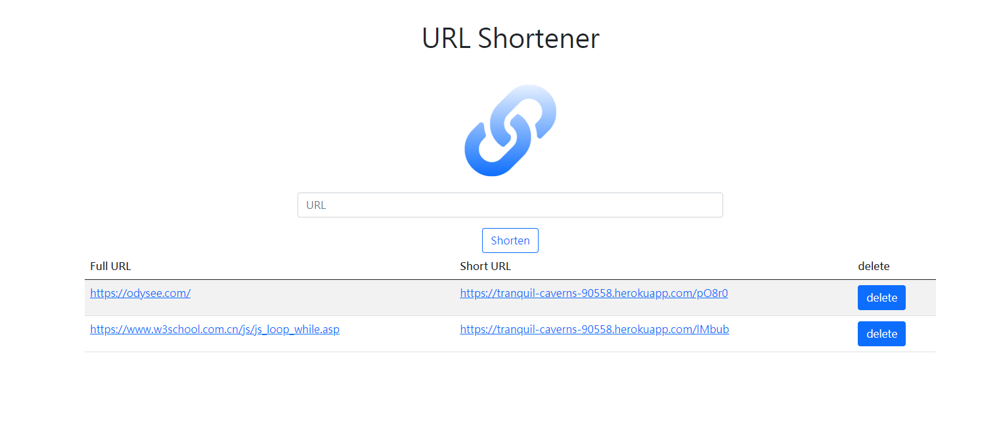

# URL Shortener

## 介紹
使用者可以在表單輸入原始網址，送出表單之後，畫面會回傳格式化後的短網址
## 環境建置
* body-parser: 1.19.0
* express: 4.17.1
* express-handlebars: 5.3.2
* method-override: 3.0.0
* mongoose": 5.13.4

## 使用方法
1. 終端機輸入指令 `git clone https://github.com/godzillalogan/shorten-URL.git`
2. 進入專案 `cd shorten-URL`
3. 安裝相關套件 `npm install`
4. 開啟專案 `npm run dev`
5. 出現以下訊息就可以在localhost:3000開啟本專案`App is running on http://localhost:3000`
